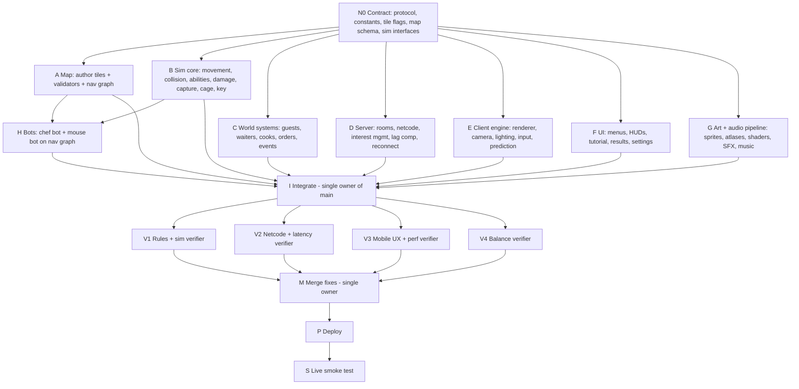

# SOUS MICE v2: Full Game Spec and Autonomous Build Brief

> **Kitchen heist. Dinner service. Two teams. One restaurant.**
> A real-time asymmetric multiplayer game for 2–8 players on phones and laptops. A colony of **Mice** raids a busy bistro for food, sabotages dishes and scares the guests. The **Chefs** must keep the restaurant running, send out every order, and catch the mice.
> This document **replaces** the earlier turn-based version (v1). Nothing from v1's rules carries over.

---

## 0. Instructions to the building agent (read first)

You are the sole builder, tester and deployer of this game. This document is the **approved design**. Do not wait for approval at any step.

1. Print a 12-line summary of the rules in your first message, then start building immediately.
2. Work with the two methods in Section 3: **graph engineering** (model the map, items, NPC behavior and order flow as graphs, validate them, parallelize only work that truly splits, verify in separate contexts) and **loop engineering** (discover → build → verify → persist loops with budgets, stop rules and a run log).
3. Build in the milestone order in Section 19. After every milestone there must be a working, deployed build. Never leave `main` broken.
4. Make small design decisions yourself and record each in `DECISIONS.md` (one line: decision, reason). Do not ask about them.
5. Ask the user **only** for the gates in Section 2.2.
6. Hold yourself to the quality bar in Section 16. A prototype with placeholder rectangles, emoji-as-art or an untested netcode path is **not done**.
7. When finished, send a final report: live URL, what was built, what was cut, known issues, how to play in 6 lines, and the store-readiness status.

**Originality rule (non-negotiable).** Everything in this game is original: characters, names, story, art, audio, text and UI. Do not use or imitate any character, scene, logo, music or asset from any film, TV show or game. The *genre* (cozy kitchen chaos, hide-and-seek, asymmetric teams) and a general *visual mood* (warm, expressive, stylized-realistic cartoon) are fair game. Specific properties are not. The mice are thieves and saboteurs, not cooks. The chefs are players. Do not name or reference any existing film or game anywhere in the product.

---

## 1. Pitch and pillars

**Elevator pitch:** *Dead-by-Daylight energy in a cartoon kitchen.* Mice sneak, steal, eat power-ups and booby-trap the chefs. Chefs juggle cooking orders and hunting. Guests in the dining room gasp, climb chairs and run screaming, and every scream tells the chefs where to look.

**Pillars**
1. **Two completely different experiences.** Mice play stealth, parkour and trickery. Chefs play pressure management: serve, patrol, trap, chase.
2. **Everything you steal has a use.** Eat it for a super-buff, deliver it to win, or slip it into a dish to ruin dinner. Never enough hands for all three.
3. **A living restaurant.** Guests, waiters and line cooks have fear, patience and reactions. They create both cover and danger.
4. **Comeback built in.** A captured mouse is not out. Teammates can hurt the chef to free them.
5. **Learnable in 60 seconds, deep for 60 matches.** Short guided tutorial per team, clear icons, no walls of text.
6. **Shippable feel.** Juice, sound, polish, accessibility and store readiness are part of the job, not an afterthought.

**Players:** 2–8. **Match length:** 8 minutes (host can pick 6 or 10). **Platforms:** phone landscape, tablet, laptop browser. Installable as a PWA. Store-wrapper ready (Section 17).

---

## 2. Autonomy policy

### 2.1 Pre-approved (no questions)
- Creating, editing and deleting files **inside the project folder**.
- Installing npm packages from the standard registry.
- Running local servers, tests, simulations, headless browsers and network-condition simulators.
- Refactoring, rewriting, reverting, and changing approach when something fails.
- Tuning any constant marked *tunable* in `shared/constants.ts`.
- Generating original art, sprites, textures and audio with the tools you have, per Section 12.
- Using **CC0 / public-domain** asset packs only when each asset's license is recorded in `ASSET_LICENSES.md`.
- Deploying to a free host that needs no new account, login or payment (including ChatGPT Sites if available).
- Cutting scope using the cut list in Section 19.

### 2.2 Human gates (stop and ask once, with exactly what you need)
- Any step that needs a **login, API key, payment, signing certificate or personal data** the user has not provided. This includes Apple Developer and Google Play accounts.
- Deleting or modifying anything **outside** the project folder.
- Anything that costs money.

If a gate triggers, keep working on everything that does not depend on it.

---

## 3. Engineering method

### 3.1 Graph engineering applied to the game's data (knowledge graphs)

Model the domain **before** writing code that uses it. Fuse **before** storing. Verify at every stage. Four graphs drive the game:

| Graph | Nodes | Edges | Stored in |
|---|---|---|---|
| **Map graph** | Rooms, holes, tunnel junctions, doors, cages, hiding spots, pickups | `CONNECTS(length, layer)`, `CONTAINS`, `GUARDS` | `content/map.json` + `content/map.tmj` (tile layers) |
| **Item and buff graph** | Foods, heavy items, buffs, tamper effects, hazards | `GIVES_BUFF`, `TAMPERS_AS`, `DELIVERS_FOR`, `DAMAGES` | `content/items.json` |
| **NPC behavior graph** | Guest, waiter, line-cook states | Transitions with triggers and timers | `content/npc.json` |
| **Order flow graph** | Order → Prep → Cook → Pass → Send → Deliver → Eat → Pay | Stage durations, failure branches | `content/orders.json` |

**Stage mapping (all four graphs):** 1 scope → 2 representation → 3 ontology → 4 entities → 5 relations → 6 events → 7 quality gate (validators, below) → 8 fusion (reuse IDs, no duplicates or synonyms) → 9 serve (`engine/content.ts` exposes typed queries; no other module reads raw JSON).

**Map validators (`scripts/validate-map.ts`, a failing validator blocks the build):**
- **M1** Every floor tile in the four public rooms is reachable by a chef from every other.
- **M2** The Burrow and all tunnel tiles are unreachable on the chef layer.
- **M3** From the Burrow, every room is reachable by mice through tunnels along at least **2 edge-disjoint paths**, so no single plugged hole cuts a room off.
- **M4** Each room has at least 2 holes (Foyer: at least 1). Every hole connects to a tunnel junction.
- **M5** For a chef carrying a captive (speed ×0.75), the travel time from any kitchen or pantry floor tile to the nearest cage is at most **9 seconds**.
- **M6** Every pickup spawn is within 14 tiles of a hole and has at least one retreat route.
- **M7** Every hiding spot has capacity at least 1 and is on a mouse-reachable tile.
- **M8** No mouse softlocks: no pockets without exit, clearance at least 0.7 tiles in all mouse-only passages.

**Content validators (`scripts/validate-content.ts`):**
- **C1** Every food has a unique ID, a provision value and either a buff, a tamper effect or both.
- **C2** Every buff has a duration or use count and a clear counter-play (listed in Section 6).
- **C3** Every NPC state has an exit transition; no dead states.
- **C4** Every order stage has a timeout and a defined failure outcome.
- **C5** Every tamper effect maps to a distinct guest reaction animation and a rating penalty.

### 3.2 Graph engineering applied to the build (task graph)

Rules: delete **fake edges** (an arrow exists only where work really flows). Use the **diamond**: split → parallel workers → *separate* verifier contexts → one owned merge. The **stop rule**: parallelize only work that splits; sequential work stays single-threaded. The **human gate** sits only where mistakes are expensive to undo (Section 2.2).



Notes:
- **N0 and I are sequential.** Do them alone and carefully. A bad contract poisons every branch.
- **A, B, C, D, E, F, G are independent** once N0 exists. If you can run parallel workers or sub-agents, do. Otherwise do them in the order A, B, D, E, C, F, G, H.
- **Verifiers must not grade their own work.** Each verifier starts from the spec section, the diff and the raw test output only. If you cannot spawn separate contexts, run a verification pass that reads only those three things.
- There is no edge between G (art, audio) and D (server). Do not couple them.

### 3.3 Loop engineering applied to the build

Design the system that discovers work, hands it to a worker, verifies, and persists state.

**State files** (create at project root in the first 5 minutes):

| File | Purpose |
|---|---|
| `STATE.md` | Current milestone, node statuses, ordered backlog, blocked items, next action. Rewrite every iteration. |
| `loop-constraints.md` | Hard rules: Sections 2, 5 and 16 of this spec, performance budgets, "never do" list. |
| `loop-budget.md` | Iteration caps and current counts. |
| `loop-run-log.md` | One line per iteration: `#, node, item, action, result, next`. Append only. |
| `gate.yaml` | The human gates. |
| `DECISIONS.md` | Decisions you made on your own. |
| `ASSET_LICENSES.md` | Source and license of every non-original asset. |

**Loop A: Build / Test / Fix** (per node)
1. **Discover:** run `npm test`, `npm run validate`, lint, typecheck. Put failures into the backlog.
2. **Dispatch:** take the top item. Make the smallest change that could fix it.
3. **Verify:** re-run that check, then the full suite, then a separate verification pass against the acceptance test (Section 18).
4. **Persist:** update `STATE.md`, append to `loop-run-log.md`.
5. **Decide:** continue, back up, or stop.

**Stop and escalation rules**
- Stop a node when its acceptance tests pass.
- Same failure signature twice in a row → **change approach**; never retry the identical fix.
- An item fails 3 attempts → mark `blocked`, try one alternative design. If that fails, apply the cut list and record it.
- Caps: **12 iterations per node, 40 per milestone, 200 total.** At a cap, ship the last green build.
- Never delete a failing test to make a build pass.

**Loop B: Bot playtest and balance**
`scripts/simulate.ts --matches 300` runs headless matches with bot chefs and bot mice (team sizes 1v1 up to 5v3). Check invariants (Section 18.1) and these targets:

| Metric | Target |
|---|---|
| Chef win rate (8-minute match, 3v3 equivalent) | 45–55% |
| Mouse win by Heist Meter | 25–40% |
| Mouse win by Rating collapse | 5–15% |
| Chef win by Lockdown (all mice caged) | 5–15% |
| Captures per chef per match | 3–9 |
| Successful rescues as share of captures | 25–45% |
| Matches ending before 5:00 | under 10% |
| Median match length | 6:30–8:00 |

If a metric is out of range, change only *tunable* constants and re-run (max 10 tuning iterations).

**Loop C: Latency and netcode**
Run matches through a test proxy that injects **RTT 40 / 120 / 200 ms with 0 / 2 / 5% packet loss and 30 ms jitter**. Check: no rubber-banding beyond 0.5 tiles, no desync of match state, grab and capture decisions are consistent for both teams, no crash. Max 6 passes.

**Loop D: UX and performance**
Capture headless screenshots of every screen at 844×390, 932×430, 1024×768 and 1440×900. Check: no overflow, tap targets at least 48 px, text at least 14 px in HUD and 16 px elsewhere, contrast at least 4.5:1. Measure client frame time in a headless browser and server tick time under load. Max 5 passes.

**Loop E: Post-deploy smoke**
After every deploy run `scripts/smoke-live.ts <url>`: two bot clients (one per team) create and join a room and play 90 seconds. On failure, roll back or fix and redeploy (max 3 attempts).

**`gate.yaml`**
```yaml
autonomy_level: L3   # unattended for build, test, fix, polish, deploy
human_gates:
  - id: credentials_payment_signing
    when: a step needs a login, API key, payment, signing certificate or personal data not provided
    action: stop_and_ask_once
  - id: outside_project
    when: a step would modify or delete files outside the project folder
    action: stop_and_ask_once
verify_with_separate_context: true
final_report_required: true
```

Unattended loops make unattended mistakes. Before the final report, re-read your own diff in the four riskiest areas: hidden-information leaks, netcode and timing, win-condition logic, deploy config.

---

## 4. Teams, goal and win conditions

### 4.1 Teams

| Team | Players | Fantasy |
|---|---|---|
| **The Colony (mice)** | 1–5 | Small, fast, sneaky. Steal, sabotage, scare. |
| **The Brigade (chefs)** | 1–3 | Big, slow, strong. Serve, patrol, trap, capture. |

Default split by player count (host can override in the lobby):

| Players | Mice | Chefs |
|---|---|---|
| 2 | 1 | 1 |
| 3 | 2 | 1 |
| 4 | 2 | 2 |
| 5 | 3 | 2 |
| 6 | 4 | 2 |
| 7 | 4 | 3 |
| 8 | 5 | 3 |

**Fill with bots** (default on): if a team has fewer than 3 mice or fewer than 2 chefs, bots fill the missing slots so a 2-device test still plays like a real match. Bots can be turned off. Bots are labeled and never count for human-only awards.

### 4.2 How the match ends
- **Mice win** if the **Heist Meter** reaches 100 (they stole enough), **or** the restaurant **Rating** reaches 0 (they ruined it).
- **Chefs win** if the **timer** hits 0 with Heist Meter below 100 and Rating above 0, **or** every mouse is **Held or Caged at the same moment** for 3 seconds (**Lockdown**).

Players may switch teams for a rematch; the lobby suggests swapping.

### 4.3 Match timeline (480 s default)

| Phase | Time | What changes |
|---|---|---|
| Briefing | before 0:00, 20 s | Map flythrough, objectives, class reminder. |
| **Opening Hours** | 0:00–2:00 | Few guests, slow orders (1 per 25 s). Mice get established. |
| **Dinner Rush** | 2:00–6:00 | Full dining room, fast orders (1 per 14 s). Events fire (4.4). |
| **Last Call** | 6:00–8:00 | Mice gain ×1.25 Heist gains; chef ability cooldowns −20%. Orders 1 per 18 s. |
| Results | after end | Winner banner, stats, awards, rematch. |

### 4.4 Events (fixed times, all tunable)
| Time | Event | Effect |
|---|---|---|
| 3:00 for 20 s | **Lights Flicker** | Light range for guests and chef sight drops from 8 to 5 tiles; mice noise radius is halved. |
| 4:00 for 60 s | **Health Inspector** | An NPC inspector walks the dining room. Every Rating loss is ×1.5. If he sees a mouse, he startles in a big way (+Rating loss 8 once). |
| 5:30 | **VIP Table** | One table orders a VIP dish (60 s patience). Serving it: Rating +10. Spoiling or losing it: Rating −12. |

---

## 5. Hidden information and fairness rules
- The server never sends a client any entity that client's team could not know about. **Interest management is by team:** an enemy is sent only if a teammate has line of sight, hears it (noise within radius), or an ability reveals it.
- A mouse **inside a tunnel**, **inside a hiding spot**, or **camouflaged and still** is not sent to chefs (unless the spot was searched, or Rat Radar hits it).
- Chefs' active snap traps are sent only to chefs, and to mice only within 2.0 tiles.
- Cooldowns and stamina of enemies are never sent.
- Match results (timers, meters) are public.
- A test must prove these (AT-05).

---

## 6. Core rules

All numbers are *tunable*. World units: **1 unit = 1 tile = about 1 metre**. Server tick: **30 Hz**.

### 6.1 Movement

| Stat | Mouse | Chef |
|---|---|---|
| Radius | 0.28 | 0.50 |
| Sneak speed | 2.2 u/s (silent) | n/a |
| Walk speed | 4.4 u/s | 3.6 u/s |
| Sprint speed | 6.4 u/s | 5.0 u/s |
| Stamina | 100, drains 22/s sprinting, regens 14/s after 1 s; below 10 you cannot sprint until 30 | 100, drains 30/s, regens 12/s |
| Carry slow-down | Small item ×0.95; heavy item ×0.6 (two carriers) | Carrying captive ×0.75 |

- Mice walk **under tables, chairs and stacks** (mouse-only tiles), through **holes**, along **ledges** (counter and shelf tops), and through **tunnels**. Chefs and guests cannot.
- Chefs cannot grab a mouse on a ledge, but a mouse on a ledge is visible and is a target for thrown colanders.
- Mouse **speed is analog on touch**: joystick push under 35% = sneak, 35–85% = walk, over 85% = sprint.

### 6.2 Noise and sight
- **Noise radius** (guests and chefs notice within it): sneak 1.5, walk 4, sprint 8, knocking an object over 10, chewing a plug 6, tampering 5. Lights Flicker halves these.
- **Sight:** guests and chefs see in a **forward cone** (guests 130°, chefs 110°) up to **8 tiles** (5 during Lights Flicker) with clear line of sight. Mice behind tables are partly covered.
- **Hide:** hiding spots (tablecloth, curtain, plant pot, barrel, flour sack) let a mouse go fully invisible (press Use; leave by pressing again). Capacity 1–2 mice. Chefs can **Search** a spot (1.2 s) to reveal and instantly grab everything in it.

### 6.3 Mouse actions

| Action | Input (touch / keyboard) | Details |
|---|---|---|
| Move | Left stick / WASD | Analog speed on touch. |
| Sprint / sneak | Stick range / Shift, Ctrl | See 6.1. |
| **Use** (context) | Use button / E | Pick up, drop, climb, enter or leave a hole, hide, tamper, tip a pot, free an ally, deliver, open a cage. Hold times in the table below. |
| **Eat** | Eat button / F | Eat the carried small food for its buff. 0.8 s, interruptible. |
| **Throw / aim** | Aim button / Q | Throw a tomato (when buffed) or a small food at a spot (distraction, 6 tile range). |
| **Dodge roll** | Dodge button / Space | 1.5 tile dash over 0.25 s, invulnerable for 0.2 s, cooldown 5 s. |
| **Class ability** | Ability button / R | See 6.7. |
| **Ping** | Ping button / Tab | Radial wheel: "Chef here", "Need help", "Go here", "Cheese here", "Rescue". |

**Use hold times:** pick up small food 0.4 s; lift heavy item with a partner 1.2 s; tamper with a dish 2.5 s; tip a soup pot 1.5 s; free an ally from a colander 1.0 s; unlock a cage with the key 1.0 s; chew a hole plug 4.0 s; place a vegetable trap 1.0 s; soup surprise 1.0 s.

### 6.4 Chef actions

| Action | Input (touch / keyboard) | Details |
|---|---|---|
| Move / sprint | Left stick / WASD, Shift | See 6.1. |
| **Grab** | Attack button / Left mouse | 0.3 s windup, range 1.1, arc 100°. Hit → mouse becomes **Held** (6.5). Miss → 0.9 s recovery. |
| **Colander Toss** | Ability 1 / Right mouse | Projectile 9 u/s, range 6, lands radius 0.6. Traps a mouse for 3 s (cannot move or act). Cooldown 14 s. A trapped mouse is auto-hit by Grab. |
| **Snap Trap** | Ability 2 / Q | Place (1 s, armed after 1.5 s). Max 3 active. Mouse stepping on it is stuck for 3.5 s (mashing shortens it). Chef gets a ping at the trap. Cooldown 10 s. |
| **Use** (context) | Use button / E | Garnish & Send (hold 2.0 s), Inspect dish (1.0 s), Search hiding spot (1.2 s), Lock a held mouse in a cage (1.0 s), Plug a hole (3.0 s; plug lasts 25 s; max 3 active), Lend a Hand at a station (6.4). |
| **Class ability** | Ability 3 / R | See 6.7. |

### 6.5 Capture, cage and rescue (the heart of the game)

1. **Capture:** A successful Grab makes the mouse **Held**. The mouse cannot use items, but can **Squirm**: mash the Use button; after **25 presses** it escapes (the chef takes no damage, the mouse gets 2 s of invulnerability).
2. **Carry:** While holding a mouse, the chef is slowed ×0.75 and cannot Grab, Colander or Snap Trap again.
3. **Rescue by damage:** If the carrying chef's **Composure** (6.6) reaches 0, he is **Flustered**, **drops the held mouse**, and the mouse is freed with 2 s invulnerability.
4. **Cage:** The chef walks to a **cage** (3 in the map) and locks the mouse in (hold Use 1.0 s). The mouse is **Caged** for **40 s**, then released automatically at that cage.
5. **The Key:** The chef who locked the cage becomes the **Keyholder** for that cage. If the Keyholder is **Flustered**, he **drops the key**; it glows on the floor for **12 s** (visible to everyone). A mouse who picks it up (0.4 s) and reaches the cage (Use 1.0 s) frees the caged mouse instantly. If nobody takes the key in 12 s, it returns to the chef.
6. **While Caged:** The mouse can spectate a teammate and can ping. It cannot act. Each cage is **visible on the minimap** to both teams.
7. **Lockdown:** If every mouse is Caged or Held at the same moment for 3 s, the **Chefs win**.

### 6.6 Hurting chefs (Composure)

Chefs have **Composure 100**. There is no death. Damage comes only from mice.

| Source | Composure damage | Extra effect | Cooldown / limit |
|---|---|---|---|
| **Soup Tip** (tip a pot on a stove ledge) | 35 | Scalded: slowed 35% for 3 s, leaves a hot puddle (6 s, slows 20% inside) | 30 s per pot; pots refill by line cooks |
| **Vegetable Trap** (carrot, potato, onion placed on the floor) | 15 | Tripped: stunned 2 s, drops carried dish or held mouse | Max 3 per mouse team at once; consumed when triggered; chefs can kick them away (walk over with Sprint to clear) |
| **Falling Pan** (nudge a pan off a shelf) | 25 | Stunned 1.5 s | 25 s per shelf |
| **Flour Sack Drop** | 10 | Blinded 3 s (screen whiteout, flour cloud) | 35 s per sack |
| **Tomato Splat** (thrown with the Tomato buff) | 10 | Blinded 2.5 s | 3 throws per buff |
| **Fire Breath** (Chili buff) | 18 per use | Cone, range 2.2 | 3 uses per buff, 1.5 s apart |

- **Regen:** +3 Composure per second after 8 s without damage.
- **At 0:** **Flustered** for 5 s (cannot move or act; drops carried dishes, held mouse and keys). Then recover to **40 Composure** and gain **6 s of damage immunity**.
- **Damage numbers on screen** and clear hit reactions (flinch, wobble, stars) on every hit.

### 6.7 Classes (pick one per match)

**Mice**
| Class | Passive | Signature ability (R) |
|---|---|---|
| **Scout** (Pip) | +10% speed; sees chef vision cones as faint arcs within 10 tiles | **Squeak Decoy:** throw a sound at a spot (within 8 tiles): chefs and guests turn to look at it. Cooldown 20 s. |
| **Hauler** (Biscuit) | Carries heavy items alone at ×0.8 speed | **Shoulder Barge:** shove a chef back 2 tiles, no damage. Cooldown 25 s. |
| **Saboteur** (Truffle) | Tampers 2× faster; carries 2 vegetable traps | **Double Tip:** next Soup Tip has no cooldown and +10 damage. Cooldown 40 s. |
| **Rescuer** (Clove) | Frees allies in 0.5 s; sees dropped keys across the map | **Lockpick:** open any cage with no key in 3.5 s (noise radius 6). Cooldown 45 s. |

A 5th mouse skin (**Nutmeg**) is a cosmetic duplicate of any class.

**Chefs**
| Class | Passive | Signature ability (R) |
|---|---|---|
| **Head Chef** (Bram) | Grab range +15% | **Rolling Pin Slam:** stuns mice within 1.8 tiles for 1.2 s. Cooldown 18 s. |
| **Sous Chef** (Odile) | 4 snap traps; Colander cooldown −25% | **Rat Radar:** reveals every mouse within 12 tiles for 3 s. Cooldown 30 s. |
| **Pastry Chef** (Wren) | +12% speed; dishes sent 40% faster | **Sugar Rush:** 3 s sprint with no stamina cost. Cooldown 20 s. |

### 6.8 Mouse objectives

All progress goes into the **Heist Meter (0–100)**. Gains are scaled by `clamp(5 / miceCount, 0.8, 2.0)` so small teams have a fair path.

| Objective | How | Heist Meter | Other effect |
|---|---|---|---|
| **Provisions Run** | Steal a small food, carry it through any hole, deliver to the **Stash** in the Burrow (Use) | +3 | Also counts toward MVP |
| **Heavy Haul** | Two mice lift and carry a **Cheese Wheel** (in the Cheese Cave) or **Tomato Crate** to the Stash | Wheel +14, Crate +10 | Heavy items slow both carriers (×0.6) |
| **Tamper** | Add a food to a **Ready dish on the Pass** (hold 2.5 s, noisy); when the dish reaches a guest, the guest reacts per the tamper table | +6 when served | Rating loss (6.9) |
| **Soup Surprise** | Pop out of a guest's soup bowl at a table (hold 1.0 s) | +3 | Table panics, order resets, Rating −6, reveals the mouse |
| **Scare Away** | Make a guest flee (guests flee on their third scare, 6.10) | +2 | Rating −4 per guest who leaves |

**Colony Orders:** two secret orders show on the mice HUD at a time, e.g. "Slip **garlic** into Table 5's soup" or "Deliver **3 cheese** to the Stash". Completing one gives **+5 Heist Meter** and a fresh order. Orders are generated from the current state so they are always possible.

**Colony Feast (stretch, M3):** Deposit 3 different foods into the **Cauldron** in the Burrow to cook a team buff: **+15% speed for all mice for 40 s**. Cooldown 120 s.

### 6.9 Foods, buffs and tampering

Eat or deliver or tamper. A mouse carries **one small food**, or half of one heavy item.

| Food | Where | Eat buff (one buff at a time; eating a new food replaces it) | Tamper effect | Delivery |
|---|---|---|---|---|
| 🧀 **Cheese wedge** | Pantry, Cheese Cave, counters | **Dash:** +45% speed and free sprint for 10 s | none | +3 |
| 🍅 **Tomato** | Pantry, kitchen counters | **Splat Shots:** 3 throwable tomatoes (range 6; 10 Composure damage, 2.5 s blind) | none | +3 |
| 🌶 **Chili pepper** | Pantry, spice shelf | **Fire Breath:** 3 cone blasts (18 damage each) | **Fire Mouth:** guest runs to water, table stalls, Rating −6 | +3 |
| 🍄 **Mushroom** | Cold room, kitchen | **Camouflage:** invisible while still or sneaking for 12 s; breaks when you act | **Sleepy:** guest dozes, table stalls 20 s, Rating −3 | +3 |
| 🧄 **Garlic clove** | Pantry, spice shelf | **Stink Cloud:** 8 s aura, radius 2.5; chefs inside slowed 25% | **Garlic Breath:** nearby guests flee a few steps, Rating −4 | +3 |
| 🍯 **Honey drop** | Pantry | **Super Grip:** 10 s; climb walls and run rafters anywhere, immune to slick floors | **Sticky:** guest stuck to the chair 10 s, Rating −3 | +3 |
| 🧀 **Cheese wheel** (heavy) | Cheese Cave | cannot eat | cannot tamper | +14 (two carriers) |
| 🍅 **Tomato crate** (heavy) | Pantry | cannot eat | cannot tamper | +10 (two carriers) |

**Counter-play for every buff:** Dash is still hit by a Colander and matched by Sugar Rush; Splat blinds only 2.5 s; Fire is a short cone; Camouflage breaks on action and Rat Radar reveals; Stink slows but does not damage; Super Grip does not stop Colander tosses.

**Pickups respawn:** each shelf restocks 1 item per 12 s up to its stock. Counter items respawn every 40 s. Heavy items respawn 90 s after delivery.

### 6.10 Chefs' objective: run the restaurant

**Orders** come from seated guests and flow through the **order graph**:

`Ticket → Prep (NPC, 12 s) → Cook (NPC, 15 s) → Ready on the Pass → Garnish & Send (chef, hold 2 s) → Waiter carries (about 9 s) → Guest eats → Pay`

- A dish sitting **Ready** for 20 s goes **cold** (Rating −3).
- A ticket waiting 90 s with no dish makes the guest **leave** (Rating −5).
- **Lend a Hand:** a chef can work a Prep or Cook station (Use, stay) to halve that stage's time.
- **Inspect** (hold 1.0 s) reveals a tampered dish; discard and remake (the order restarts at Cook). Serving a tampered dish costs Rating (tamper table) and the guest reacts visibly.
- **Rating** (0–100, starts at **70**): sent dish **+2** (**+4** if sent within 10 s of ready), VIP **+10**, mouse captured **+1**; losses as listed above, plus **−1** each time a guest first sees a mouse.

### 6.11 Guests and NPC reactions (the realism layer)

NPCs are real systems, not decoration.

**Guest state machine** (full graph in `content/npc.json`):
`Arriving → Seated → Ordering → Waiting → Eating → Paying → Leaving`
with interrupts: `Suspicious → Startled → Panicked → Fleeing → Calming`.

- **Sight meter:** a mouse in a guest's sight cone with clear line of sight fills their meter by **+50/s** (sneaking: +20/s; hidden or camouflaged-still: 0). It decays at 10/s after 3 s without sight.
- At **100** the guest is **Startled**: gasp, point, freeze (1 s). The chefs get an **alert ping** (arrow and exclamation) at the mouse's last known position. Rating −1 (first time per guest).
- A second Startle within 15 s makes them **Panicked**: climb onto the chair, scream (noise radius 10), spill a drink, and **spread fear** (+40 sight meter to guests within 4 tiles).
- A third makes them **Flee** through the front door: Rating −4, Heist +2, their table's order is cancelled.
- A panicked guest **calms** after 12 s with no sight.
- **Waiters** who see a mouse drop their tray (dish lost, noise, Rating −3) and flee for 6 s.
- **Line cooks** who see a mouse shout and swat with a ladle if within 1.5 tiles: 1 s stun on the mouse, no capture. They also alert chefs.
- **Dish reactions:** each tamper effect plays a distinct reaction (fire-breathing, sleepy slump, sticky chair, garlic gag).
- **Animations and barks:** at least 8 guest idle, eating, startled and panicked animations, and 10 distinct barks (gasp, yelp, "Waiter!", "Is that a MOUSE?!", and so on). All family-friendly.

---

## 7. The map: The Rusty Ladle

One bistro, one map for v1. Size **72 × 48 tiles**. Author it as tile layers (floor, walls, props, mouse-only, ledges, holes, hiding spots, pickups, zones) in a Tiled-compatible JSON (`.tmj`) or an equivalent format of your choice.

### 7.1 Schematic floor plan
```
x:0                                   47 48                71
 ┌───────────────────────────────────────┬─────────────────────┐ y:0
 │  DINING ROOM                          │  FOYER & BAR        │
 │  8 tables, curtains, plants,          │  host stand, front  │
 │  baseboard holes H1 H2 H3             │  door, hole H4      │
 │                                       │                     │ y:19
 ├──────── PASS (serving window y=20, x 10–34) ───────┬────────┤
 │  MAIN KITCHEN                         │  PANTRY & COLD ROOM │ y:21
 │  3 stoves, prep tables, sink,         │  dry store shelves, │
 │  2 cages (K1, K2), pots on ledges,    │  Cheese Cave (SW),  │
 │  holes H5 H6 H7                       │  Cold Room (E),     │
 │                                       │  cage P1, H8 H9 H10 │ y:38
 ├───────────────────────────────────────┴─────────────────────┤
 │  CELLAR + WALL VOIDS (mouse-only):  tunnels  +  THE BURROW  │ y:39–47
 └─────────────────────────────────────────────────────────────┘
```

### 7.2 Zones (approximate rectangles; adjust as needed so validators pass)

| Zone | Tiles | Contents |
|---|---|---|
| **Dining Room** | x0–47, y0–19 | 8 tables (2 guests each), curtains, plants, chandeliers, baseboard holes, swing door to kitchen at (36, 20) |
| **Foyer & Bar** | x48–71, y0–19 | Host stand, bar with stools, front door at (70, 10), coat rack |
| **Pass** | y = 20, x10–34 | Serving counter (ledge). Ready dishes appear here. Waiters pick up here. |
| **Main Kitchen** | x0–39, y21–38 | 3 stoves with ledge pots, prep tables, sink, dish pit, shelves with pans, hanging pots, 2 cages: **K1 (4, 36)**, **K2 (34, 24)** |
| **Pantry & Cold Room** | x40–71, y21–38 | **Dry Store** (x40–59): shelves of food and flour sacks. **Cold Room** (x60–71): mushrooms, chili, honey. **Cheese Cave** (x40–49, y31–38): cheese wheels. Cage **P1 (56, 36)**. Wide door to the kitchen at (40, 28). |
| **Cellar and wall voids** | y39–47 and wall cavities | Mouse-only. Tunnels, junctions, and the Burrow. |
| **The Burrow** (hideout) | x26–45, y41–47 | **Stash** (delivery point), Cauldron, a cozy nest, fairy-light candles stolen from the dining room. **Chefs cannot enter.** |

### 7.3 Secret routes (tunnel graph)

Ten **holes** (`H1–H10`) are small arched doorways in baseboards, behind cabinets and under sinks. Chefs can **see** holes but cannot enter. They are connected through **junctions** `T1–T5` and the Burrow `B`.

| Edge | Length (tiles) |
|---|---|
| B – T1 | 8 |
| T1 – T2 | 10 |
| T1 – T3 | 12 |
| T3 – T4 | 16 |
| T4 – T5 | 14 |
| T5 – T2 | 18 |
| T1 – H5 (kitchen, under sink) | 14 |
| T1 – H6 (kitchen, behind stove) | 18 |
| T3 – H7 (kitchen, by cage K1) | 10 |
| T2 – H8 (pantry, behind shelf) | 12 |
| T2 – H9 (Cheese Cave back) | 16 |
| T2 – H10 (cold room drain) | 20 |
| T4 – H1, T4 – H2 (dining, behind curtain / under bar) | 8, 10 |
| T4 – H3 (dining, under table cluster) | 12 |
| T5 – H4 (foyer, coat rack) | 8 |

The junctions `T1–T3–T4–T5–T2–T1` form a **ring**, so plugging any single hole or cutting any single tunnel edge does not isolate a room (validator M3).

Extra routes:
- **Rafter Run:** a mouse-only route along kitchen ceiling pipes from H6 to the shelf above the Pass. It passes over chef heads, and mice on it can drop Falling Pans and Flour Sacks. Reached by climbing (ramps at the end points; anywhere with Super Grip).
- **Dumbwaiter shaft** (stretch): a one-way ride from the Pantry to the Pass counter.

### 7.4 Interactive objects (all server-authoritative)
- **Soup pots** on stove ledges (6): tip to scald.
- **Hanging pans and shelf pans** (8): nudge to drop.
- **Flour sacks** (4): drop to blind.
- **Loose vegetables** (carrots, potatoes, onions) on the floor and counters: pick up to make traps.
- **Hiding spots** (14): tablecloths (8), curtains (2), plant pots (2), barrels (2).
- **Cages** (3), **Cheese Cave door** (opens slowly; noise radius 5).
- **Chef plug stations:** none. Chefs plug by hand.

### 7.5 Lighting zones
Kitchen warm orange. Dining warm gold with candle pools. Pantry cool teal. Cold Room blue. Cellar and tunnels dim amber from tiny lamps. Burrow cozy amber. These zones drive both visuals and the Lights Flicker event.

---

## 8. Screens and UX

Phones are played in **landscape** with two thumbs. A **portrait** screen shows "Rotate your phone" with an animation. Laptops use keyboard and mouse. Gamepad support is a stretch.

### 8.1 Flow
```
Title → (Create room | Join with code | Quick match* ) → Lobby → Team + Class → Briefing
  → Match → Results → (Rematch → Lobby)
Tutorial (Training Kitchen) available from Title and Lobby, auto-offered on first launch
(*Quick match is stretch)
```

### 8.2 Title screen
Animated key art: the bistro at night, mice peeking from a hole, a chef silhouette in a window. Buttons: **Play**, **Join**, **Training Kitchen**, **Settings**, **Credits**. Install-PWA prompt shown tastefully.

### 8.3 Lobby and team select
- Room code, copy link, share, player list with team chips.
- Pick **Mice** or **Chefs**; pick a **class** (cards with icon, passive, signature ability and difficulty).
- Host options: match length, fill with bots, bot difficulty (Easy, Normal, Hard), auto-balance, rematch swap.
- Ready check; host starts. Late joiners watch as spectators.

### 8.4 Briefing (20 s)
A quick flythrough of the map with labels. Team-specific "Your job" cards: 3 icons and one sentence each. Skippable by all players readying.

### 8.5 Mouse HUD (landscape)
```
┌──────────────────────────────────────────────────────────────────────────┐
│ ⏱ 4:12   HEIST ▓▓▓▓▓▓░░░░ 58%   ⭐ RATING 41   [orders] 🧄→T5 🧀×3        │
│                                                                    ⛶ map │
│                                                                          │
│  [ joystick ]                  (game view)                  [Use][Eat]   │
│     ○                                                       [Dodge][Abil]│
│  stamina ▓▓▓▓░                                              [Ping][Aim]  │
│  buff: 🧀 Dash 6s           carrying: 🍅                                 │
└──────────────────────────────────────────────────────────────────────────┘
```
- Top: timer, **Heist Meter**, **Rating**, current **Colony Orders**.
- Minimap (toggle): own and teammate positions, known cages, dropped keys, chef alert icons, holes.
- Context prompts appear above the Use button ("Hide", "Tip pot", "Deliver").
- A thin **danger vignette** when a chef is near (within 6 tiles, in LOS).
- **Caged** view: grayscale, spectate teammates, timer ring, "Rescue incoming" icon when a rescuer is close.

### 8.6 Chef HUD (landscape)
```
┌──────────────────────────────────────────────────────────────────────────┐
│ ⏱ 4:12   ⭐ RATING 41   HEIST 58%   🍽 TICKETS: T3 soup ▓▓▓ | T6 pasta ▓░ │
│  ⚠ alert arrows around the screen edge                                   │
│  [ joystick ]                  (game view)                 [Grab][Use]   │
│  composure ▓▓▓▓▓▓▓░░░                                       [Colander]    │
│  stamina ▓▓▓░░                                              [Trap][Abil] │
└──────────────────────────────────────────────────────────────────────────┘
```
- **Ticket rail:** each order with a patience bar and its stage (Prep, Cook, Ready, Sending, Delivered). Ready dishes ping on the Pass.
- **Alert arrows** at screen edges for guest startles, plug chews, trap triggers and noise ripples.
- **Mouse count** and **cages status** (who is Held or Caged, timers).

### 8.7 Pause and settings
Resume, Settings, Leave. **Settings:** master/SFX/music/voice volume, haptics, graphics quality (Low/Medium/High), left-handed layout, button size, colorblind mode, reduced motion, screen shake, subtitles for barks, control remapping on keyboard.

### 8.8 Results
Winner banner with the win reason, match stats (Heist, Rating, captures, rescues, dishes sent, tampers, guests scared), **awards** (MVP per team, Cheese Thief, Iron Chef, Escape Artist, Best Rescuer, Pan Master), and **Rematch** (swap teams suggested).

### 8.9 Tutorials: the Training Kitchen
A **60–90 s guided scenario for each team**, with a bot opponent and a skippable overlay:
- **Mouse:** move and sneak → steal a cheese → eat it (Dash) → deliver through a hole → tip a soup pot on a bot chef → free a caged bot ally with the key. Ends with "You're ready."
- **Chef:** send a dish at the Pass → inspect a tampered dish → grab a bot mouse → carry it to a cage → place a snap trap → search a hiding spot.
Each step highlights its control and the target; nothing advances until done. Required once before the first online match (skippable afterward).

---

## 9. Controls

| Action | Touch | Keyboard / mouse |
|---|---|---|
| Move | Left stick (analog) | WASD |
| Sprint / sneak | Stick range (mice); Sprint button (chef) | Shift / Ctrl |
| Use | Use button | E |
| Eat (mouse) | Eat button | F |
| Throw / aim (mouse) | Aim button + drag | Q + mouse |
| Dodge roll (mouse) | Dodge button | Space |
| Class ability | Ability button | R |
| Grab (chef) | Grab button | Left mouse |
| Colander (chef) | Colander button + drag to aim | Right mouse |
| Snap trap (chef) | Trap button | Q |
| Ping | Ping button (radial) | Tab |
| Map | Map button | M |
| Squirm (when held) | Mash the Use button | Mash E |
| Pause | Menu icon | Esc |

Feel rules:
- Buttons are at least **56 px**, placed for thumbs, with a **left-handed** swap option.
- **Input buffering:** inputs within 120 ms of a state change are queued.
- **Aim assist** for throws and Colander on touch (soft snap to the nearest valid target within 20°).
- **Haptics:** light tap on grab, double tap on startled guests nearby, heavy buzz when captured, success buzz on deliver (where `navigator.vibrate` exists).
- Disable page zoom, pull-to-refresh, text selection and context menus during play.

---

## 10. Art direction ("stylized realism")

### 10.1 Target
A warm, richly lit, expressive **stylized-realistic cartoon** with the polish of a premium mobile game: believable materials and light, characters with appeal and personality, readable at a glance on a phone. It is an **original style**. It must not reproduce any film's characters, sets, props, logos or compositions.

### 10.2 Camera and rendering
- **3/4 top-down (2.5D)** camera, about 55° tilt, following the player with look-ahead. Zoom 1.0× default; a dynamic pull-back when chased.
- **Renderer:** WebGL via **PixiJS** (or Three.js with an orthographic camera if you can reach this look). Layers: floor, floor decals, props back, characters (y-sorted), props front, ceiling and rafters (fade when a mouse goes under), lighting, particles, UI.
- **Lighting:** a light map with warm key lights (windows, pendant lamps, stove glow, candles), soft radial pools, an ambient tint per zone (7.5), and contact shadows under every object and character. Specular glints on copper and steel. A subtle vignette and filmic color grade. Real-time shadow polish is optional; baked contact shadows are required.
- **Depth cues:** parallax on ceiling props and lamps, gentle depth-of-field blur at the screen edges (can be a shader or an overlay), atmospheric steam and dust motes.

### 10.3 Palette
Warm copper `#C9772B`, saffron `#F2B33D`, tomato `#D6432F`, cream `#FFF1D6`, deep teal `#1F5560`, aubergine night `#2A1830`, sage `#8FB28A`, wine `#7A1F3D`. UI accent: saffron on aubergine. These are guidance; a coherent palette beats a rigid one.

### 10.4 Characters
- **Mice (5 skins):** Pip (red scarf), Biscuit (heavier build, tool belt), Truffle (goggles, apron pockets), Clove (green bandana, tiny lockpick), Nutmeg (spotted ears, satchel). Large expressive eyes, individual ear shapes, visible fur layering, whiskers, tail that reacts to movement, cheek puff when carrying food. Animations: idle, sneak, walk, sprint, dodge roll, carry, eat, hide, climb, squirm, captured, caged, celebrate, throw, tip, chew.
- **Chefs (3 skins):** Bram (big, round, red apron), Odile (tall, quick, trap belt), Wren (small, speedy, pastry whites). Caricatured proportions, expressive brows, steam from ears when angry. Animations: idle, walk, sprint, grab windup, grab, carry-captive, colander toss, set trap, cook, send dish, stunned, scalded, blinded, flustered, recover, celebrate.
- **NPCs:** 6 guest silhouettes with palette variants, 2 waiter types, 3 line cooks, 1 inspector. Reaction poses per Section 6.11.

### 10.5 Environment
Checkered tile floors, worn wood, stone walls, copper pans, stacked crates, hanging garlic, steam from pots, wine bottles, tablecloths, candles, chandeliers, a fireplace in the Foyer. Every zone has a distinct silhouette and color mood so players always know where they are. Props are tagged with gameplay meaning (ledges, hiding spots) using consistent visual language (small outline shimmer on interactables when near).

### 10.6 VFX and juice
Hit-stop (50–80 ms) on captures and big hits, screen shake (settings-controlled), squash and stretch on landings and dodges, floating damage numbers, steam, flour clouds, tomato splats, fire breath, sparkles on delivered food, dust puffs from sprinting, ripples for noise, speed lines for Dash, camera punch-in on capture, slow-mo on the winning moment.

### 10.7 UI kit
A consistent component set: cards, buttons (pressed state), chips, meters (cheese-wedge Heist Meter, star Rating, ladle-fill Composure), tooltips, toasts, modals. Hand-crafted icons for every food, ability and status (no emoji in the shipped UI). Typography: a friendly display face for headings (for example "Baloo 2" or "Fredoka") and a clean body face (for example "Nunito"), loaded with `font-display: swap`; bundle the fonts if allowed.

### 10.8 Tiered art pipeline (try in order, record in `DECISIONS.md`)
1. **Tier 1 (always achievable):** procedurally and vector-built sprite atlases with layered gradients, outlines and baked lighting; lit by the light map. Must still look cohesive and intentional.
2. **Tier 2 (preferred if tools allow):** original sprites and textures generated with an image tool, cleaned and packed into atlases, plus CC0 packs where the license allows. Keep one style bible so the assets match. Record every source.
3. **Tier 3 (stretch):** a 3D version with low-poly models. Only if Tier 1 and 2 are done and polished.

Asset budgets: total download under **15 MB** (first playable screen under **6 MB**, rest lazy-loaded), texture atlases at most 2048×2048, PNG or WebP, 60 fps on a mid-range phone.

---

## 11. Audio
No audio file may be used unless original or CC0 (recorded in `ASSET_LICENSES.md`). Default: synthesized with the Web Audio API.

- **Mix buses:** music, SFX, ambience, UI, with ducking on big events.
- **Spatial audio:** volume falls off with distance, stereo pan by direction; occlusion muffles sounds through walls.
- **Ambience per zone:** sizzle and clatter (kitchen), murmured conversations and cutlery (dining), cold hum (cold room), dripping (cellar).
- **SFX:** footsteps by surface (tile, wood, stone), mouse squeaks, gasp and scream variety, grab, colander clang, trap snap, soup pour, pan clang, tomato splat, fire whoosh, eating crunch, dish bell at the Pass, cage lock and key jingle, UI taps.
- **Music:** a plucky, playful dynamic score with layers that rise with tension (more chase = more layers), a calm Burrow theme, a sting for win and lose. Muted by default until the first tap; mute toggle remembered.
- **Barks:** short synthesized or stylized vocal stings for guests (no real voices needed); subtitles available.

---

## 12. Technical architecture

### 12.1 Stack
- **Language:** TypeScript across client, server and shared code. **Bundler:** Vite. **Renderer:** PixiJS. **Server:** Node.js 20 with `ws`. **Tests:** Vitest, plus Playwright for end-to-end. **Package layout:** one repo, npm workspaces (`shared`, `server`, `client`, `bots`).
- **Shared simulation:** a **deterministic fixed-step simulation** in `shared/sim` used by the server (authoritative) and by the client (prediction for the local player). No I/O, a seeded RNG, no `Date.now()` inside the sim.

### 12.2 Hosting reality check (do this at the start of N0)
This game needs **a host that keeps a server running with WebSockets**. Static-only hosting cannot hold the match simulation. Before building the server:
1. If **ChatGPT Sites** is available, test whether it can run a Node server with WebSockets. If yes, use it.
2. Otherwise choose a free host with a long-running Node process and `wss://` (for example Render, Railway or Fly.io; check each one's current free-tier terms, region and sleep behavior). Pick a region close to North America.
3. If only static hosting is available, host the client there and use a hosted realtime/room service (for example PartyKit, Ably, Supabase Realtime) behind a second `Transport` adapter. The simulation stays unchanged, but check that the service supports your tick and message rate.
4. Record the choice and reasoning in `DECISIONS.md`. If the free host sleeps, add a "waking the kitchen" loading screen that retries for 45 s.

### 12.3 Netcode (server-authoritative)
- **Tick:** server sim at **30 Hz**. **Snapshots:** to clients at **15 Hz** (during chaos you may go to 20 Hz), delta-encoded; quantize positions to 1/16 tile in 16-bit integers; budget ≤ **3 KB per snapshot** at 8 players and 40 NPCs.
- **Input:** clients send input frames `{seq, tick, moveX, moveY, buttons (bitmask), aimX, aimY}` at 30 Hz; the server applies them in order and acks the last processed `seq`.
- **Prediction and reconciliation:** the local player moves immediately using the shared sim; on each snapshot, the client rewinds to the acked `seq`, replays unacked inputs, and smooths any correction over 100 ms (snap if the error exceeds 1 tile).
- **Interpolation:** remote entities are drawn **100 ms behind** with interpolation; brief extrapolation (max 150 ms) on missing packets.
- **Lag compensation:** hits (Grab, Colander landing, Fire Breath cone) are validated on the server against a **position-history buffer** of the last 250 ms, rewound by the attacker's estimated one-way latency (capped at **150 ms**). The server's ruling is final; clients show hit effects only when confirmed (with a short predicted flinch).
- **Time sync:** `ping/pong` with server time, lowest-RTT of the last 5 samples for the offset.
- **Interest management:** per-team visible sets (Section 5), computed on the server at 10 Hz with grid raycasts; always send guests and orders (public), and entities revealed by abilities.
- **Rates and limits:** 40 messages per second per connection, size cap 2 KB per message; unknown or illegal messages are dropped.
- **Reconnect:** a session token in `localStorage`; rejoin within **60 s** restores the same player. A disconnected mouse becomes immobile and untargetable for 5 s, then a bot takes over until they return.
- **Host migration:** the lobby leader moves to the next connected human.

### 12.4 Rooms and match lifecycle
- Room code alphabet `ABCDEFGHJKLMNPQRSTUVWXYZ23456789`, 4 characters.
- States: `LOBBY → BRIEFING → MATCH → RESULTS → LOBBY`.
- A room closes after 2 hours of inactivity or 10 minutes empty.
- Names: trimmed to 12 characters, de-duplicated; no profanity (a simple filter), no free text chat. Only **quick pings and preset phrases** are allowed, which also keeps the game store-safe for younger players.

### 12.5 Messages
Client → server:
```
join {code, name, team?, class?, token?}   setTeam {team}   setClass {class}   ready {value}
start {}      input {seq, tick, mx, my, buttons, ax, ay}      ping {kind, x?, y?}
time {t0}     leave {}      host {options}
```
Server → client:
```
joined {playerId, token, code}    lobby {players, hostId, options}     briefing {map, roles}
snap {tick, ackSeq, entities[], meters, events[]}                      event {kind, data}
result {winner, reason, stats, awards}                                 pong {t0, serverTime}   error {code}
```
`entities` carry only what the receiving team may see (Section 5).

### 12.6 Bots
Bots use the **nav graph** exported from the map validators.
- **Chef bot:** state machine `Patrol → Investigate (alerts, noise) → Chase → Grab → Carry → Cage → Resume`, plus `Serve` when a dish is Ready and no mouse is near; places traps at chokepoints; avoids obvious vegetable traps.
- **Mouse bot:** state machine `Plan (pick a provision or order) → Sneak → Steal → Retreat via hole → Deliver`, with `Flee` from chefs, `Hide`, and `Rescue` if an ally is held or caged and the key is free. Difficulty tunes reaction time (Easy 600 ms, Normal 350 ms, Hard 200 ms) and mistake rate.
- Bots use the same input channel as humans; no cheating (no perfect knowledge, they use the same visibility rules).

### 12.7 Suggested file tree
```
sous-mice/
  STATE.md  loop-constraints.md  loop-budget.md  loop-run-log.md  gate.yaml  DECISIONS.md  ASSET_LICENSES.md
  README.md  package.json
  shared/    constants.ts  protocol.ts  tile-flags.ts  sim/ (world.ts movement.ts abilities.ts damage.ts capture.ts
             items.ts npc.ts orders.ts events.ts rng.ts)  content/ (map.json map.tmj items.json npc.json orders.json barks.json)
  server/    index.ts  rooms.ts  transport-ws.ts  interest.ts  lagcomp.ts
  client/    index.html  main.ts  net.ts  predict.ts  input.ts  render/ (renderer.ts lighting.ts camera.ts particles.ts)
             screens/ (title.ts lobby.ts teamselect.ts briefing.ts hud-mouse.ts hud-chef.ts results.ts settings.ts tutorial.ts)
             art/ (atlases, shaders)  audio/ (engine.ts mixer.ts sfx.ts music.ts)
  bots/      chef-bot.ts  mouse-bot.ts  navgraph.ts
  tests/     sim.test.ts  map.test.ts  content.test.ts  hidden-info.test.ts  e2e/ (two-clients.spec.ts)
  scripts/   validate-map.ts  validate-content.ts  simulate.ts  latency-proxy.ts  smoke-live.ts  screenshots.ts
  store/     icons/  screenshots/  listing.md  privacy.md  terms.md  capacitor.config.ts
```

---

## 13. Rules for edge cases
- **Simultaneous grab and dodge:** if the dodge invulnerability frame overlaps the grab hit time (server-rewound), the dodge wins.
- **Two chefs grab one mouse:** the earliest server-timestamped hit wins; the other grab whiffs.
- **Chef Flustered while sending a dish:** the dish drops and goes cold in 20 s unless picked up.
- **Key dropped in the Pantry while the only rescuer is Caged:** the key returns after 12 s.
- **Mouse eats while Held:** not allowed.
- **A heavy item with a disconnected carrier:** drops on the spot.
- **Last mouse is Caged but a key is on the floor:** the Lockdown timer pauses while any mouse is within 2 tiles of the key and free.
- **All chefs disconnect:** bots take over; if no bots, the match ends as "Chefs left" with no penalty.
- **Lights Flicker and Inspector overlap:** both apply; Rating multiplier stacks only once.
- **Ties at timer end:** Chefs win (the house always wins).
- **Impossible Colony Order:** regenerate silently.

---

## 14. Accessibility
- **Colorblind modes** (protanopia, deuteranopia, tritanopia) and icons plus shapes for all team and status cues.
- **Reduced motion**, adjustable screen shake, flash reduction.
- **Subtitles** for barks and key sounds. **Haptics** toggle.
- Button size and **left-handed** layout, control remapping.
- Text at least 14 px in HUD, 16 px elsewhere; contrast at least 4.5:1.
- No required voice chat. No free-text chat.

---

## 15. Performance budgets
| Area | Budget |
|---|---|
| Client frame rate | 60 fps target; no worse than 30 fps on a 2019 mid-range phone on Medium |
| Client frame time | ≤ 12 ms average on a mid-range laptop |
| Server tick | ≤ 6 ms average at 8 players + 40 NPCs; ≤ 15 ms p99 |
| Bandwidth | ≤ 40 KB/s down and ≤ 8 KB/s up per client |
| Load | first playable screen under 6 MB; full under 15 MB; time to interactive under 4 s on 4G |
| Memory | under 300 MB on mobile |
| Battery | no busy loops; pause rendering when the tab is hidden |

---

## 16. Quality bar (no "AI slop")

A build is **not done** if any of these is true:
- Any shipped screen uses placeholder rectangles, lorem ipsum, default browser fonts, emoji as final art, or unstyled controls.
- A core action has no sound, no animation and no feedback.
- A button lacks a pressed state, a disabled state or a label.
- Netcode shows rubber-banding at 120 ms RTT, desync, or a crash in a 200-ms test.
- A hidden-information leak exists (AT-05).
- The tutorial can be skipped into a state where a new player is confused.
- Errors are shown as raw text or the console shows uncaught exceptions.
- Loading, empty and error states are missing (no "room not found", no "reconnecting").
- The game cannot be played one-thumb-per-hand on a phone in landscape.
- It runs below 30 fps on a mid-range device.

**Polish checklist (must all be true before the final report):**
- Consistent UI kit, icons and typography on every screen.
- Every action has animation, sound and a clear state change.
- Juice (hit-stop, shake, particles) is present and tunable.
- Consistent camera behavior, no clipping through walls or props.
- Smooth transitions between all screens; skeleton or branded loading screens.
- Settings persist; accessibility options work.
- The first 60 seconds of each team are tuned: clear goal, quick win, safe failure.

---

## 17. Store readiness (App Store and Google Play)

**Reality check:** the contest requires a live URL; the store release needs accounts and signing that only the owner can supply. Prepare everything you can, stop at the gates.

**Do (pre-approved):**
- **PWA:** manifest, service worker (cache static assets), icons (192, 512, maskable), splash screens, `display: fullscreen`, `orientation: landscape`.
- **Capacitor wrapper config** (`capacitor.config.ts`, `npx cap add ios/android` instructions) with landscape lock, safe-area insets, status-bar handling, and a `README` of build steps.
- **Store assets:** 1024×1024 icon, adaptive icon layers, feature graphic, 6 screenshots per size (phone and tablet) captured from real gameplay, short and long descriptions, keywords, `store/listing.md`.
- **Compliance:** `store/privacy.md` (no accounts, no personal data, no tracking, ephemeral room data), `store/terms.md`, age-rating notes (cartoon mild violence, suitable for 9+), no ads, no in-app purchases, no external links in the game, content moderation via presets only.
- **Credits and licenses** screen and `ASSET_LICENSES.md`.

**Gates (ask the user once):** Apple Developer and Google Play accounts, signing certificates and keys, any fees, and actual submission.

---

## 18. Testing and acceptance

### 18.1 Invariants (checked in every simulated match)
- Rating and Heist Meter stay in 0–100. Composure in 0–100. Stamina in 0–100.
- A mouse is in at most one of: free, Held, Caged. A Held mouse always has exactly one holder.
- Each cage has at most one occupant and one key owner.
- No entity is ever inside a solid tile; no chef is ever on a mouse-only tile.
- Every match ends within `matchLength + 90 s`.
- Server snapshots never contain forbidden fields (Section 5).

### 18.2 Acceptance tests (all must pass before the final report)
| ID | Test |
|---|---|
| AT-01 | Two browser contexts: A creates a room, B joins with the code, both appear in the lobby within 1 s; each picks a different team. |
| AT-02 | A host-started match runs on both clients with the same timer within 250 ms. |
| AT-03 | `validate-map` (M1–M8) and `validate-content` (C1–C5) pass. |
| AT-04 | Core loop on the server: a mouse steals, eats, delivers; a chef grabs, carries and cages; Heist and Rating change as specified. |
| AT-05 | **Hidden-information test:** capture every message sent to a chef during a match; no mouse in a tunnel, hiding spot (unsearched) or camouflaged-still ever appears, and no mouse cooldown data is ever sent. Same check for mice vs chef cooldowns and snap traps beyond 2 tiles. |
| AT-06 | Rescue: Composure to 0 on a carrying chef frees the Held mouse; Flustered on a Keyholder drops the key; key delivery frees the Caged mouse; auto-release at 40 s. |
| AT-07 | Win conditions: Heist 100 → Mice; Rating 0 → Mice; timer → Chefs; Lockdown 3 s → Chefs. |
| AT-08 | Guest reactions: a mouse in sight fills the meter; Startle sends an alert to chefs; three Startles make a guest flee; Rating and Heist change as specified. |
| AT-09 | Orders: ticket → Ready → Send → Delivered; cold dish and timeout penalties apply; tampered dishes produce the matching reaction. |
| AT-10 | Reconnect within 60 s restores the player, team, class and carried item. |
| AT-11 | **Latency:** matches at RTT 40/120/200 ms with up to 5% loss show no desync and no correction larger than 0.5 tiles in 95% of frames. |
| AT-12 | 300 simulated matches across team sizes: no exceptions, all invariants hold, balance targets met. |
| AT-13 | Tutorial: following the on-screen steps literally completes both Training Kitchens with no dead ends. |
| AT-14 | Screenshots at four sizes: no overflow, tap targets at least 48 px, contrast at least 4.5:1. |
| AT-15 | Performance budgets (Section 15) met on server and in headless client measurements. |
| AT-16 | Live URL: open in a private window, create a room, join from a second device or context, play 90 seconds on both teams. |

### 18.3 Unit-test priorities
Movement and collision; capture, squirm, cage and key logic; damage and Composure; sight meters and NPC transitions; order pipeline and ratings; interest management; lag-compensated hit checks; map graph validators; bot decision loops.

---

## 19. Milestones and cut list

**M1: Vertical slice (must ship, deployed)**
Lobby with room codes and teams. Map with all four zones, Burrow, tunnels, holes. Movement and collision, netcode with prediction and interpolation. Mouse: sneak/walk/sprint, pick up, deliver, eat Cheese (Dash) and Tomato (Splat), Dodge, Soup Tip, Vegetable Trap. Chef: Grab, carry, cage, Colander, Garnish & Send. Order pipeline and Rating. Guest sight, Startle and flee. Win conditions. Both HUDs. Basic bots. Basic art (Tier 1) and core audio.

**M2: Depth (should)**
All foods and buffs, tamper, Colony Orders, hiding spots and Search, Snap Trap, Plug, Key and Composure rescue, all classes, Rafter Run, Falling Pan and Flour Sack, events (Lights Flicker, Inspector, VIP), Panic spreading, waiters and line cooks, both Training Kitchens, settings and accessibility, latency polish, store assets and PWA.

**M3: Delight (could)**
Tier 2 art pass, dynamic music, Colony Feast, Soup Surprise, Dumbwaiter, cosmetics unlocked locally, spectator camera, replay highlights, Capacitor project scaffolding, gamepad.

**Cut order if time or budget runs out (cut from the bottom first):**
1. Gamepad
2. Replay highlights
3. Cosmetics
4. Dumbwaiter
5. Colony Feast
6. Soup Surprise
7. Rafter Run
8. Waiters and line-cook reactions (keep guests)
9. Classes (fall back to one mouse and one chef kit)
10. Tamper (keep stealing, fighting and rescue)

Never cut: hidden-information rules, capture → rescue loop, guest reactions, reconnect, tutorial, live deployment.

---

## 20. Definition of done
- [ ] Two or more players can join from separate devices with a room code and play on opposite teams.
- [ ] A new player can learn their team from the Training Kitchen alone.
- [ ] A full 8-minute match completes with humans and bots without errors on 2, 4 and 8 players.
- [ ] The game is live at a public URL that loads in a private window.
- [ ] AT-01 to AT-16 pass; results recorded in `loop-run-log.md`.
- [ ] The quality bar (Section 16) is met, with the checklist ticked.
- [ ] `DECISIONS.md` and the final report list everything cut, changed or at risk.
- [ ] Store readiness assets are prepared and the remaining gates are listed for the user.
- [ ] README has the URL, how to play, how to run locally, and credits.
